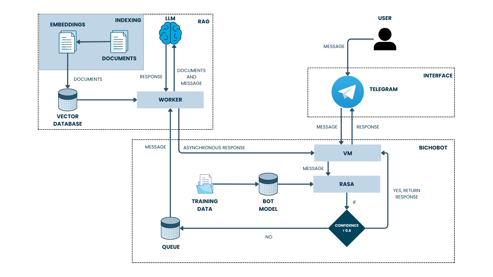

# BichoBot

**BichoBot** é um chatbot desenvolvido para auxiliar calouros da Universidade Federal do Ceará – Campus Quixadá. Ele responde dúvidas frequentes sobre a vida acadêmica de forma rápida, precisa e centralizada, utilizando tecnologias modernas como **RASA**, **RAG** e **LLMs** (LLaMA 3).

## ✨ Funcionalidades

- Respostas instantâneas via Telegram
- Cobertura de tópicos essenciais:
  - 📚 Biblioteca
  - 🍽️ Restaurante Universitário
  - 🎓 Bolsas e assistência estudantil
  - 🚌 Horários de ônibus e localização
  - 🧭 Sistemas acadêmicos e matrícula
- Fallback inteligente para perguntas abertas usando RAG + LLM

## 🧠 Arquitetura

O BichoBot combina duas abordagens:

1. **RASA** – Para perguntas objetivas com alta previsibilidade.
2. **RAG + LLaMA 3** – Para perguntas abertas e complexas.

 <!-- Substitua pela imagem do diagrama, se disponível -->

- Banco vetorial: [Qdrant](https://qdrant.tech)
- Execução local do modelo: [Ollama](https://ollama.com)
- Geração de embeddings: [Sentence-Transformers](https://www.sbert.net/)

### Exemplo de perguntas que o sistema responde:
- *"Como faço matrícula?"*
- *"Quais os horários dos ônibus?"*
- *"Existe residência universitária em Quixadá?"*

## 🛠️ Como executar localmente RASA + RAG

> ⚠️ **Pré-requisitos:**
> - Python 3.9
> - Docker instalado e em execução
> - [Ollama](https://ollama.com) com o modelo **LLaMA 3** baixado localmente
> - Token do Telegram configurado no arquivo `.env`
> - [Qdrant](https://qdrant.tech) (servidor vetorial, rodando via Docker)

---

### 🔧 Etapas de configuração

```bash
# 1. Clone o repositório
git clone https://github.com/seu-usuario/bichobot.git
cd bichobot

# 2. Crie o arquivo .env com seu token e URL do RASA
cp .env.example .env
# Edite o .env com o seu token do Telegram

# 3. Instale as dependências Python
pip install -r requirements.txt
```
### 🐳 Subindo o Qdrant com Docker
```bash
docker run -p 6333:6333 -p 6334:6334 qdrant/qdrant
```
📝 Essa é apenas uma sugestão, você pode usar outro banco Qdrant já upado em sua máquina

### 📦 Popular o banco vetorial do Qdrant
```bash
cd vector_database
python populate_database_Qdrant.py
cd ..
```
### 🤖 Treinando o RASA
```bash
rasa train --domain domain
rasa run
```

### 💬 Executando o bot do Telegram
```bash
cd bot
python bot.py
```

## 📁 Estrutura do Repositório

```bash
bichobot/
├── actions/
│   ├── __init__.py
│   ├── actions.py
│   └── get_embedding_Qdrant.py
├── bot/
│   ├── bot.py
│   └── llm_worker.py
├── data/
│   ├── nlu/
│   │   ├── assistencia.yml
│   │   ├── biblioteca.yml
│   │   ├── bolsas.yml
│   │   ├── cursos.yml
│   │   ├── localizacao.yml
│   │   ├── nlu.yml
│   │   ├── onibus.yml
│   │   ├── projetos.yml
│   │   ├── quixada.yml
│   │   ├── ru.yml
│   │   └── sistemas.yml
│   ├── rules/
│   │   ├── assistencia.yml
│   │   ├── biblioteca.yml
│   │   ├── bolsas.yml
│   │   ├── cursos.yml
│   │   ├── localização.yml
│   │   ├── onibus.yml
│   │   ├── projetos.yml
│   │   ├── quixada.yml
│   │   ├── ru.yml
│   │   ├── rules.yml
│   │   └── sistemas.yml
│   └── stories/
│       └── assistencia.yml
├── domain/
│   ├── assistencia.yml
│   ├── biblioteca.yml
│   ├── bolsas.yml
│   ├── cursos.yml
│   ├── domain.yml
│   ├── localizacao.yml
│   ├── onibus.yml
│   ├── projetos.yml
│   ├── quixada.yml
│   ├── ru.yml
│   └── sistemas.yml
├── results/
├── tests/
│   └── test_stories.yml
├── vector_database/
│   ├── data/
│   │   ├── aproveitamento.pdf
│   │   ├── avaliacao institucional.txt
│   │   ├── biblioteca.txt
│   │   ├── Bolsas info.pdf
│   │   ├── bolsas.txt
│   │   ├── calendario2025.txt
│   │   ├── cursos.pdf
│   │   ├── duvidas frequentes.txt
│   │   ├── eduroam.txt
│   │   ├── estagio.pdf
│   │   ├── geral.pdf
│   │   ├── matricula online.pdf
│   │   ├── matricula.pdf
│   │   ├── nas.pdf
│   │   ├── onibus.pdf
│   │   ├── procedimento trancamento.pdf
│   │   ├── psicologia.pdf
│   │   ├── regimento.txt
│   │   ├── reservas de sala.pdf
│   │   ├── ru e nutricao.pdf
│   │   └── servico social.pdf
│   ├── get_embedding_Qdrant.py
│   ├── populate_database_Qdrant.py
│   └── search_test.py
├── .gitignore
├── config.yml
├── credentials.yml
├── endpoints.yml
├── graph.html
├── README.md
└── requirements.txt

```

## 🤝 Contribua com o BichoBot!

Se você tem ideias, encontrou bugs, ou quer ajudar a adaptar o BichoBot para outras instituições, toda contribuição é bem-vinda.
Vamos juntos tornar o acolhimento estudantil mais acessível, tecnológico e humano. 💙

---

📬 Entre em contato ou contribua abrindo uma [issue](https://github.com/sheiely/bichobot/issues) ou [pull request](https://github.com/sheiely/bichobot/pulls).  
Feito com dedicação 🚀
